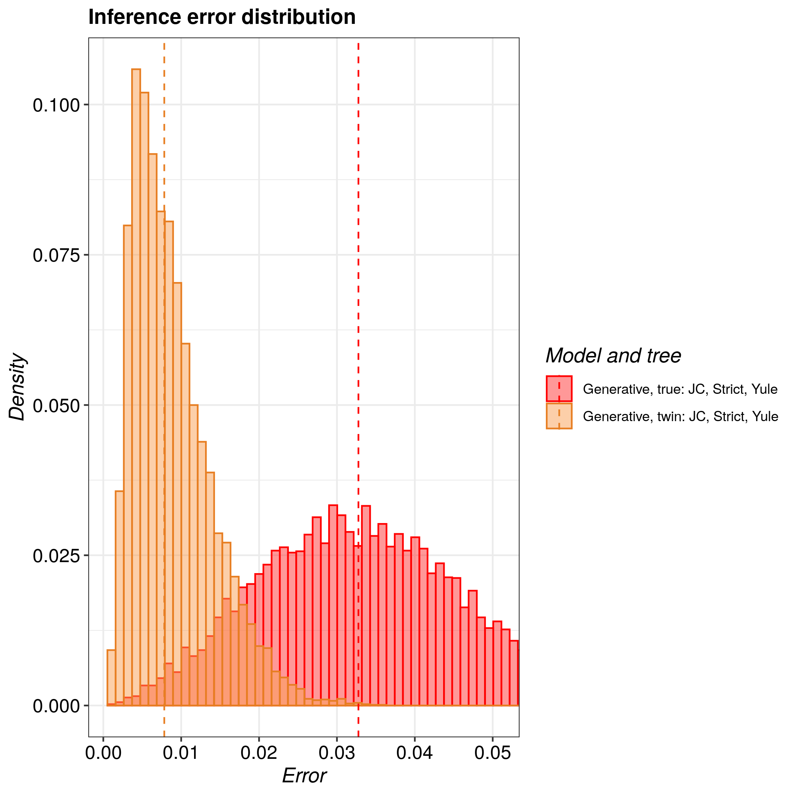
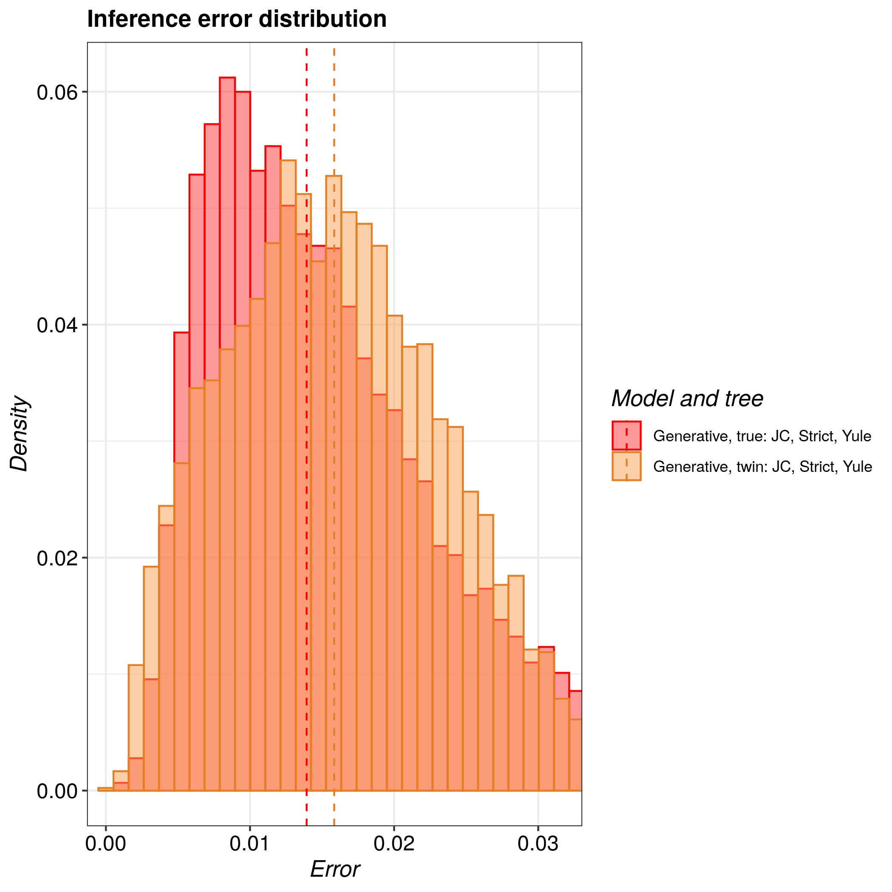
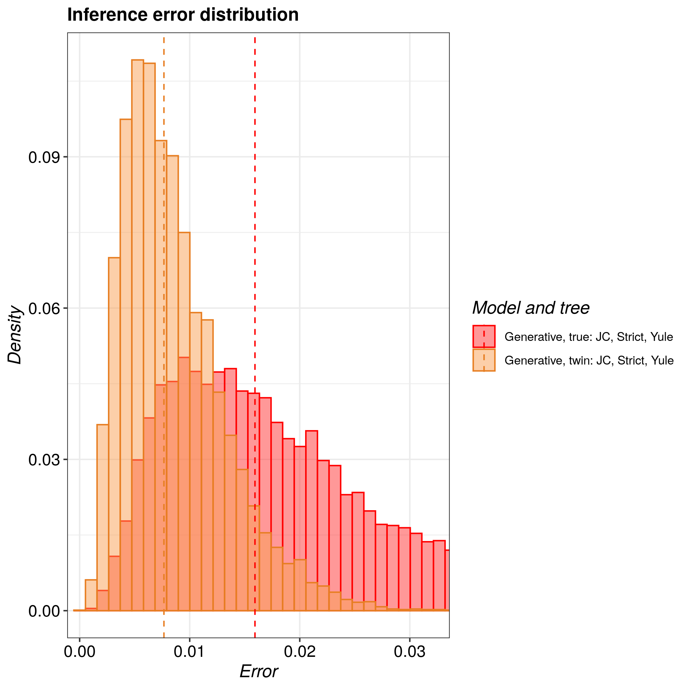
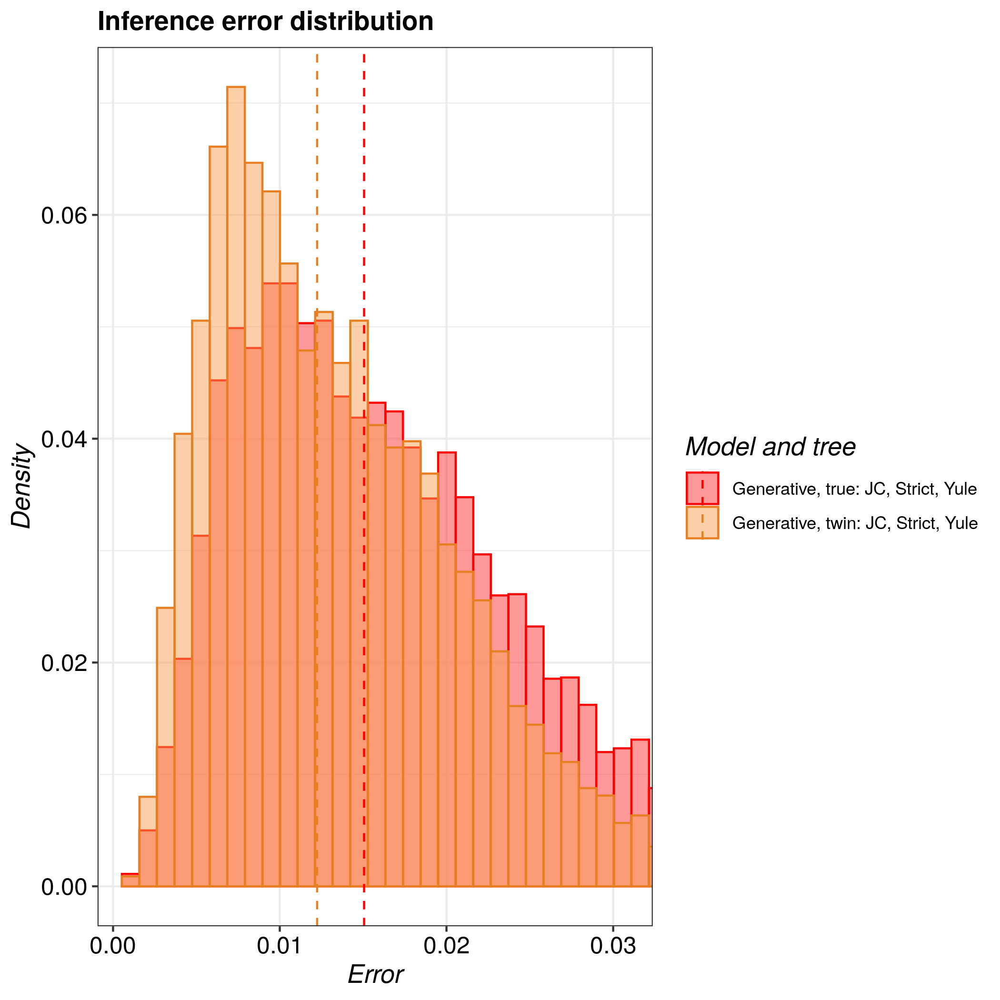

# pirouette_example_25

Branch   |                                                                                                 |                                                                                               
---------|--------------------------------------------------------------------------------------------------------------------------------------------------------------|--------------------------------------------------------------------------------------------------------------------------------------------------------------------------------------------
`master` | |?
`develop`||?

A [pirouette example](https://github.com/richelbilderbeek/pirouette_examples).

## Results

